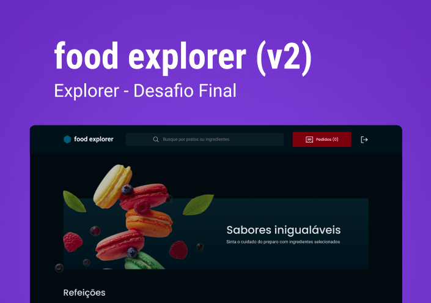

# <h1 align="center">Food-Explorer</h1>

<p align="center">Final Challenge Rockeseat Explorer course</p>

<p align="center">
  <a href="#-Worked-concepts">Worked concepts</a>&nbsp;&nbsp;&nbsp;|&nbsp;&nbsp;&nbsp;
  <a href="#-Technologies">Technologies</a>&nbsp;&nbsp;&nbsp;|&nbsp;&nbsp;&nbsp;
  <a href="#-Project">Project</a>&nbsp;&nbsp;&nbsp;|&nbsp;&nbsp;&nbsp;
  <a href="#-License">License</a>
</p>

<p align="center">
  
</p>

## 📁 Project

The application is an interactive menu for a fictitious restaurant.

the application has an adminstrator and user interface. It has an adminstrator and user interface.

# ✔ Funcionalities

- Login
- Add user
- Add dishes
- Edit dishes
- Show dishes
- Delete dishes
- Filter dishes
- Logout

## 🚀 Technologies

- Axios
- ReactJS
- Styled Components
- ViteJS

## 💻 Project

## 💡 Usage

Deploy: https://stately-monstera-e92228.netlify.app

To run on your machine locally. Make sure you have Node.js and npm installed before committing with the steps below:

1. Clone repository:
  ```
teste
```
2. Install dependencies

3. Start server


## 👤 Users

This application has two interfaces: admin and user. The admin can manage the menu by adding, editing and removing dishes. The user can see the menu and search for dishes by filtering by name and ingredients

To access the user interface, use the following login information:

User:
-Email: user@email.com
-Password: user123

To access the admin interface, use the following login information:

Admin:

-Email: admin@email.com
-Password: admin123

<p align="center">
  
</p>

## 📝 License
<p align="center">
  
</p> 
